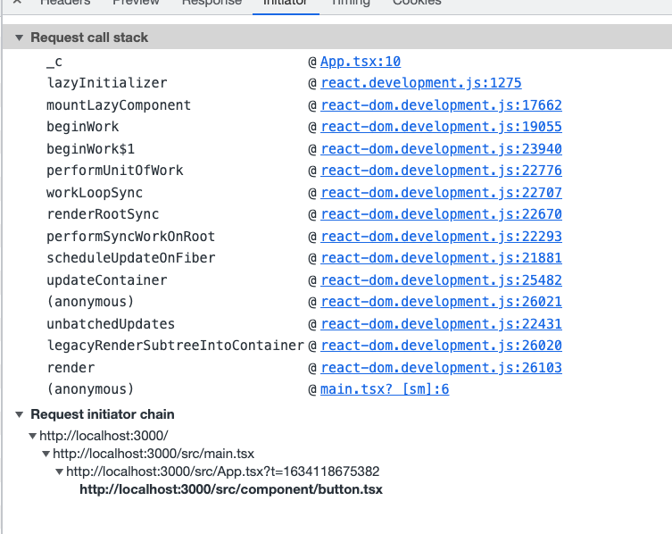

### react Suspense lazy
1. 为什么需要 Suspense lazy
 - 大型项目为了code split 优化首屏加载，减少白屏时间，优化用户体验

2. Suspense lazy 原理
 - 基于webpack 的 动态import 语法
 ```js
 import('lodash').then(...)
 ```
 webpack 会把import（xx）的资源打包成一个单独的 bundle，实现代码 code split，当代码中执行import的时候，会动态加载单独的 bundle。

 ```js
 // 该组件是动态加载的
 const OtherComponent = React.lazy(() => import('./OtherComponent'));

function MyComponent() {
  return (
    // 显示 <Spinner> 组件直至 OtherComponent 加载完成
    <React.Suspense fallback={<Spinner />}>
      <div>
        <OtherComponent />
      </div>
    </React.Suspense>
  );
}
 ```
 Suspense 组件在react 17 fiber 架构中已经不是组件了，而是一个类型
```js
REACT_SUSPENSE_TYPE as Suspense,

```
react.lazy 是一个函数,返回一个thnable对象，第一次render的时候，直接render Suspense 的fallback属性，等待浏览器动态加载 lazy CMP，然后执行react的update
```js
export function lazy<T>(
  ctor: () => Thenable<{default: T, ...}>,
): LazyComponent<T, Payload<T>> {
  const payload: Payload<T> = {
    // We use these fields to store the result.
    _status: Uninitialized,
    _result: ctor,
  };
  ....
   }
```

